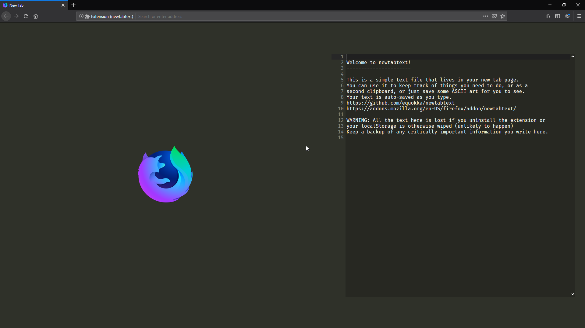

# newtabtext

This is an extension that replaces the new tab page with a cleaner layout and a plain text editor, where the contents persist between sessions. It's not intended to be used for any one thing, which is why it's just plain text.

The editor used is [Ace Editor](https://github.com/ajaxorg/ace), or more specifically, the concatenated and minified build from [ace-builds](https://github.com/ajaxorg/ace-builds). Original license can be found [inside the `ace` folder](./ace/LICENSE).

## Installation

You can download and install the extension on [addons.mozilla.org](https://addons.mozilla.org/en-US/firefox/addon/newtabtext/).

## Screenshot



## Checklist

* [x] Basic functionality
* [ ] Basic style settings
* [ ] Basic Ace Editor settings
* [ ] Tabs (?)
* [ ] Basic Localization
* [ ] Remove unused editor files
* [ ] Make a better looking extension icon
* [ ] Other browsers

## Debugging

Acquire [web-ext](https://github.com/mozilla/web-ext):

```sh
npm install --global web-ext
```

Run the extension:

```sh
web-ext run
```

Run lint tasks (Do `npm i` first):

```sh
npm run lint
```

## Building from source

```sh
web-ext build
```

## License

MIT (see [LICENSE](./LICENSE))
